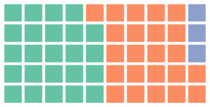

# PyWaffle

[](https://pypi.org/project/pywaffle/)
[](https://readthedocs.org/projects/pywaffle/badge/?version=latest&style=flat)
[](https://mybinder.org/v2/gh/gyli/PyWaffle/master?filepath=demo.ipynb)

PyWaffle is an open source, MIT-licensed Python package for plotting waffle charts.

It provides a [Figure constructor class](https://matplotlib.org/gallery/subplots_axes_and_figures/custom_figure_class.html) `Waffle`, which could be passed to [matplotlib.pyplot.figure](https://matplotlib.org/api/_as_gen/matplotlib.pyplot.figure.html) and generates a matplotlib Figure object.

PyPI Page: [https://pypi.org/project/pywaffle/](https://pypi.org/project/pywaffle/)

Documentation: [http://pywaffle.readthedocs.io/](http://pywaffle.readthedocs.io/)

## Installation

```python
pip install pywaffle
```

## Requirements

* Python 3.5+
* Matplotlib

## Examples

### 1. Basic Example

```python
import matplotlib.pyplot as plt
from pywaffle import Waffle
```

```python
fig = plt.figure(
    FigureClass=Waffle, 
    rows=5, 
    columns=10, 
    values=[48, 46, 6],
    figsize=(5, 3)
)
plt.show()
```



The values are automatically scaled to 24, 23 and 3 to fit 5 * 10 chart size.

### 2. Values in dict & Scaling

```python
data = {'Democratic': 48, 'Republican': 46, 'Libertarian': 3}
fig = plt.figure(
    FigureClass=Waffle, 
    rows=5, 
    values=data, 
    legend={'loc': 'upper left', 'bbox_to_anchor': (1.1, 1)}
)
plt.show()
```


In this example, since only `rows` is specified and `columns` is empty, absolute values in `values` are used as block numbers. Similarly, `rows` could also be optional if `columns` is specified.

If `values` is a dict, its keys are used as labels.

### 3. Title, Legend, Colors, Background Color, Block Color, Direction and Style

```python
data = {'Democratic': 48, 'Republican': 46, 'Libertarian': 3}
fig = plt.figure(
    FigureClass=Waffle, 
    rows=5, 
    values=data, 
    colors=("#983D3D", "#232066", "#DCB732"),
    title={'label': 'Vote Percentage in 2016 US Presidential Election', 'loc': 'left'},
    labels=[f"{k} ({v}%)" for k, v in data.items()],
    legend={'loc': 'lower left', 'bbox_to_anchor': (0, -0.4), 'ncol': len(data), 'framealpha': 0},
    starting_location='NW',
    block_arranging_style='snake'
)
fig.set_facecolor('#EEEEEE')
plt.show()
```


Many parameters, like `title` and `legend`, accept the same parameters as in Matplotlib.

### 4. Icons

```python
data = {'Democratic': 48, 'Republican': 46, 'Libertarian': 3}
fig = plt.figure(
    FigureClass=Waffle, 
    rows=5, 
    values=data, 
    colors=("#232066", "#983D3D", "#DCB732"),
    legend={'loc': 'upper left', 'bbox_to_anchor': (1, 1)},
    icons='child', 
    font_size=12, 
    icon_legend=True
)
```
    


PyWaffle supports [Font Awesome](https://fontawesome.com/) icons in the chart.

### 5. Multiple Plots

```python
import pandas as pd
data = pd.DataFrame(
    {
        'labels': ['Hillary Clinton', 'Donald Trump', 'Others'],
        'Virginia': [1981473, 1769443, 233715],
        'Maryland': [1677928, 943169, 160349],
        'West Virginia': [188794, 489371, 36258],
    },
).set_index('labels')

# A glance of the data:
#                  Maryland  Virginia  West Virginia
# labels                                            
# Hillary Clinton   1677928   1981473         188794
# Donald Trump       943169   1769443         489371
# Others             160349    233715          36258


fig = plt.figure(
    FigureClass=Waffle,
    plots={
        '311': {
            'values': data['Virginia'] / 30000,
            'labels': [f"{k} ({v})" for k, v in data['Virginia'].items()],
            'legend': {'loc': 'upper left', 'bbox_to_anchor': (1.05, 1), 'fontsize': 8},
            'title': {'label': '2016 Virginia Presidential Election Results', 'loc': 'left'}
        },
        '312': {
            'values': data['Maryland'] / 30000,
            'labels': [f"{k} ({v})" for k, v in data['Maryland'].items()],
            'legend': {'loc': 'upper left', 'bbox_to_anchor': (1.2, 1), 'fontsize': 8},
            'title': {'label': '2016 Maryland Presidential Election Results', 'loc': 'left'}
        },
        '313': {
            'values': data['West Virginia'] / 30000,
            'labels': [f"{k} ({v})" for k, v in data['West Virginia'].items()],
            'legend': {'loc': 'upper left', 'bbox_to_anchor': (1.3, 1), 'fontsize': 8},
            'title': {'label': '2016 West Virginia Presidential Election Results', 'loc': 'left'}
        },
    },
    rows=5,  # shared parameter among subplots
    colors=("#2196f3", "#ff5252", "#999999"),  # shared parameter among subplots
    figsize=(9, 5)  # figsize is a parameter of plt.figure
)
```
    


In this chart, 1 block = 30000 votes.

<sub>Data source [https://en.wikipedia.org/wiki/United_States_presidential_election,_2016](https://en.wikipedia.org/wiki/United_States_presidential_election,_2016).</sub>

## Demo

Wanna try it yourself? There is [Online Demo](https://mybinder.org/v2/gh/gyli/PyWaffle/master?filepath=demo.ipynb)!

## What's New

See [CHANGELOG](CHANGELOG.md)

## License

* PyWaffle is under MIT license, see `LICENSE` file for the details.
* The Font Awesome font is licensed under the SIL OFL 1.1: http://scripts.sil.org/OFL
