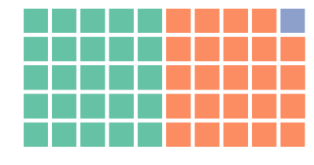

# PyWaffle

PyPI page: https://pypi.python.org/pypi/pywaffle

Documentation: Working on it

## Introduction

PyWaffle is a Python package to make waffle chart, bases on [Matplotlib](https://matplotlib.org/).

It provides a [Figure constructor class](https://matplotlib.org/devdocs/gallery/subplots_axes_and_figures/custom_figure_class.html) `Waffle`, which could be passed to [matplotlib.pyplot.figure](https://matplotlib.org/devdocs/api/_as_gen/matplotlib.pyplot.figure.html) and generates a matplotlib Figure object.

## Installation

```python
pip install pywaffle
```

## Examples

#### 1. Basic Example

```python
import matplotlib.pyplot as plt
from pywaffle import Waffle

# The values are rounded to 10 * 5 blocks
fig = plt.figure(FigureClass=Waffle, rows=5, columns=10, values=[48, 46, 3])
plt.show()
```



#### 2. Values in dict & Auto-columns

```python
data = {'Democratic': 48, 'Republican': 46, 'Libertarian': 3}
fig = plt.figure(FigureClass=Waffle, rows=5, values=data, legend_conf={'loc': (0, -0.3)})
plt.show()
```


If columns is empty, it uses absolute number in values as block number. It is now clear to see that there are 3% votes to other parties/candidates.

#### 3. Title, Legend, Colors and Background Color

```python
data = {'Democratic': 48, 'Republican': 46, 'Libertarian': 3}
fig = plt.figure(
    FigureClass=Waffle, rows=5, values=data,
    title_conf={'label': 'Vote Percentage in 2016 US Presidential Election', 'loc': 'left'},
    colors=("#983D3D", "#232066", "#DCB732"),
    labels=["{0} ({1}%)".format(k, v) for k, v in data.items()],
    legend_conf={'loc': (0, -0.3), 'fontsize': 10, 'framealpha': 0}
)
fig.gca().set_facecolor('#EEEEEE')
fig.set_facecolor('#EEEEEE')
plt.show()
```


Data source [https://en.wikipedia.org/wiki/United_States_presidential_election,_2016](https://en.wikipedia.org/wiki/United_States_presidential_election,_2016).

#### 4. Use Font Awesome icons

```python
data = {'Democratic': 48, 'Republican': 46, 'Libertarian': 3}
fig = plt.figure(
    FigureClass=Waffle, rows=5, values=data, legend_conf={'loc': (0, -0.3)},
    colors=("#232066", "#983D3D", "#DCB732"),
    icons='child', icon_size=18, interval_ratio_y=0.3,
)
```
    


## License

PyWaffle uses the MIT license, see `LICENSE` file for the details.
